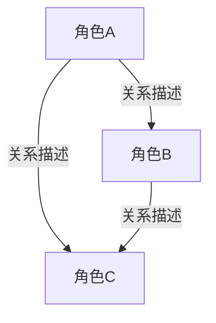

# S4 角色开发 — 交付物模板

> 本文件定义 S4 阶段所有交付物的标准输出格式。写作时按此模板填充具体内容。

---

## 交付物 ① 角色设定卡（主角）

> 每个主角一张完整设定卡。

```
[SWS-ITEM: 角色设定卡]
【角色设定卡】

角色名：[名称]
外观特征：[面部特征、发型发色、体型等核心视觉特征]
标志性服装：[日常着装风格与关键服装描述]
配色：[角色主色调]
标志性道具：[常伴道具]
性格标签：[3–5 个核心性格词]
说话风格：[语言签名特征]
口头钉子：[标志性口头禅或句式]
情感表达方式：[内敛隐忍/直接爆发/冷嘲热讽/行动代替言语]
备注：[其他影响视觉呈现的特征]

---
**详细档案**

**基本信息**
- 年龄：
- 身份：
- 一句话人设：

**背景故事**
- 出身：
- 关键经历：
- 创伤/秘密：

**能力与技能**
- 主要能力：
- 关键弱点：
- 成长潜力：

**目标与动机**
- 外在目标：
- 内在需求：
- 最大恐惧：

**角色弧光**
- 起点：
- 转折：
- 终点：
- 弧光主题：

**角色总结**
- 一句话定位：
- 核心矛盾：
- 观众代入点：

（每个主角一张卡）
[/SWS-ITEM]
```

## 交付物 ② 配角速写卡

> 每个配角一张速写卡。

```
[SWS-ITEM: 配角速写卡]
【配角速写卡】

角色名：[名称]
外观特征：[核心视觉特征，1句话]
标志性服装：[主要着装]
性格标签：[1-2个核心词]
说话风格：[一句话概括]
出场范围：第X集–第Y集
与主角关系：[一句话]

（每个配角一张速写卡）
[/SWS-ITEM]
```

## 交付物 ③ 人物关系图

```
[SWS-ITEM: 人物关系图]
【人物关系图】

**关系矩阵**

| 角色A | 角色B | 关系类型 | 初始状态 | 终末状态 | 核心张力 |
|-------|-------|----------|----------|----------|----------|
| [A]   | [B]   | [类型]   | [初始]   | [终末]   | [张力]   |

**关系变化时间线**

- 第X集：[事件] → [关系A↔B 从...变为...]
- 第Y集：[事件] → [关系A↔C 从...变为...]

**Mermaid 可视化**



[/SWS-ITEM]
```

## 交付物 ④ 角色弧光轨迹

```
[SWS-ITEM: 角色弧光轨迹]
【角色弧光轨迹】

**[主角名称] 弧光轨迹**

| 集数范围 | 角色状态 | 标志性行为 | 弧光阶段 |
|----------|----------|------------|----------|
| 第1-X集  | [状态]   | [行为]     | 起点     |
| 第X-Y集  | [状态]   | [行为]     | 发展     |
| 第Y-Z集  | [状态]   | [行为]     | 转折     |
| 第Z-末集 | [状态]   | [行为]     | 确立     |

弧光主题：[一句话总结]

（每个主角一段弧光轨迹）
[/SWS-ITEM]
```

## 锚点文档组装格式

> S4 确认后，从 S1/S2/S4 交付物中组装锚点文档。

```
[SWS-ANCHOR]

[SWS-ITEM: 创作锚点清单]
（从 ${PROJECT_DIR}/draft/s1-ideation.md 中提取完整的创作锚点清单）
[/SWS-ITEM]

[SWS-ITEM: 风格DNA卡]
（从 ${PROJECT_DIR}/draft/s2-setting.md 中提取完整的风格DNA卡）
[/SWS-ITEM]

[SWS-ITEM: 角色设定卡]
（从 S4 交付物中提取全部主角角色设定卡）
[/SWS-ITEM]

[SWS-ITEM: 配角速写卡]
（从 S4 交付物中提取全部配角速写卡）
[/SWS-ITEM]

[/SWS-ANCHOR]
```
