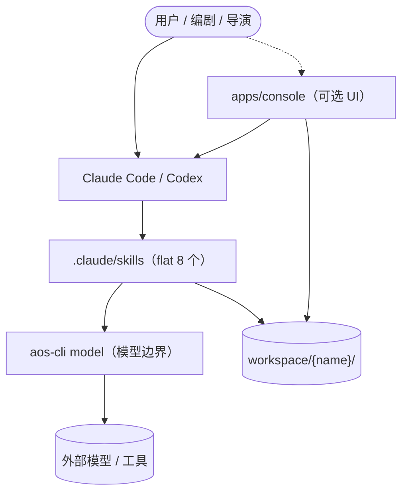
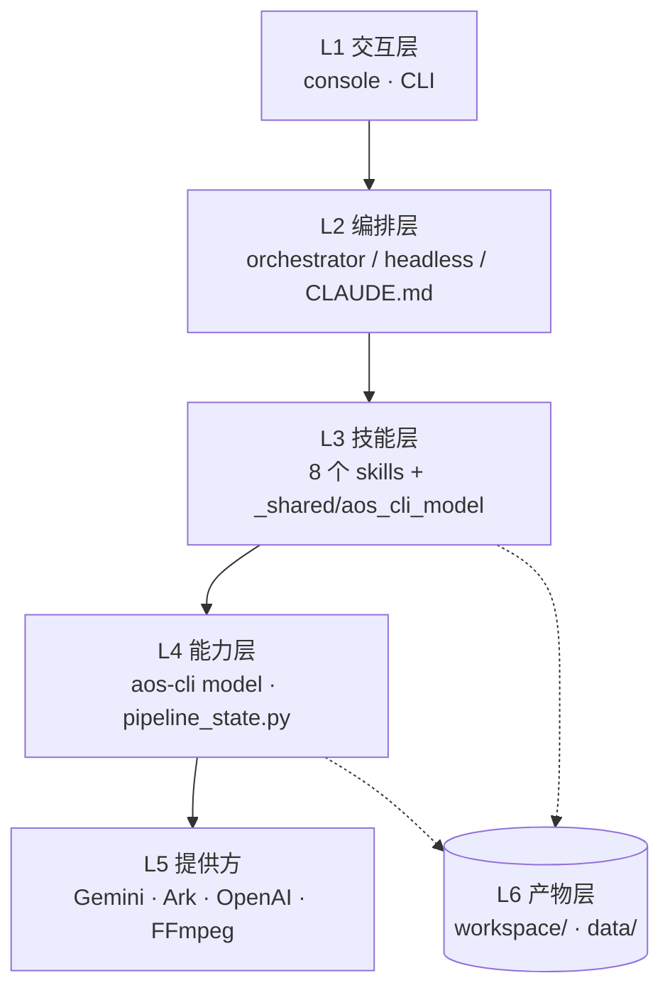
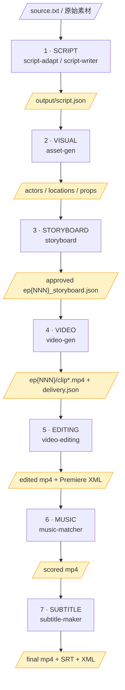
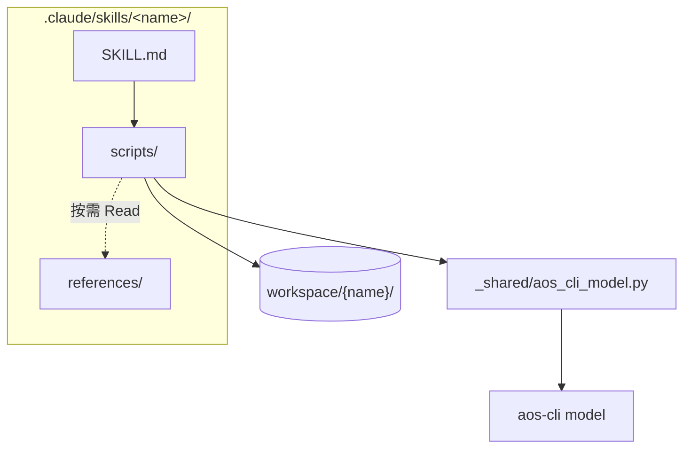
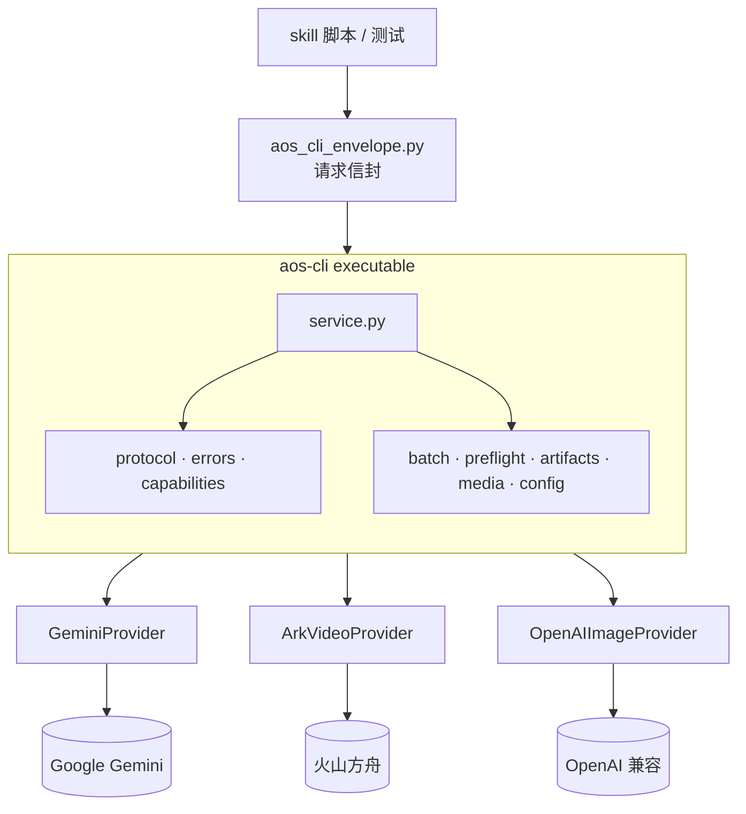
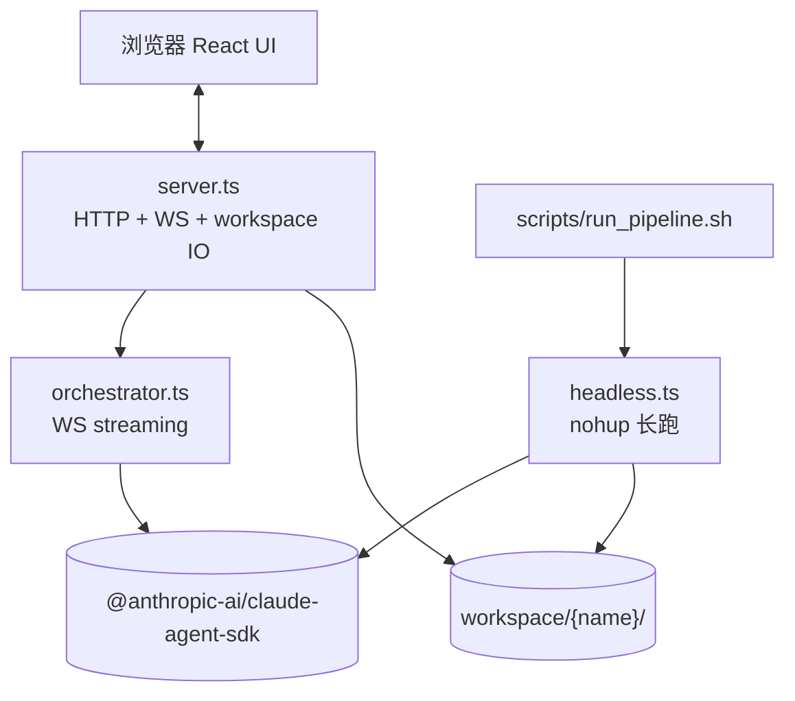
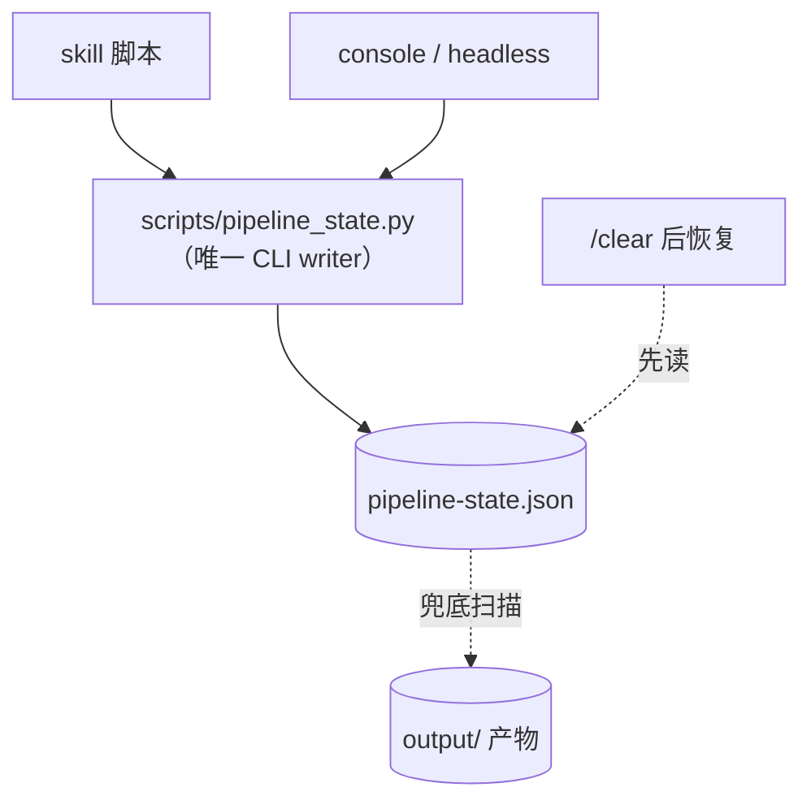
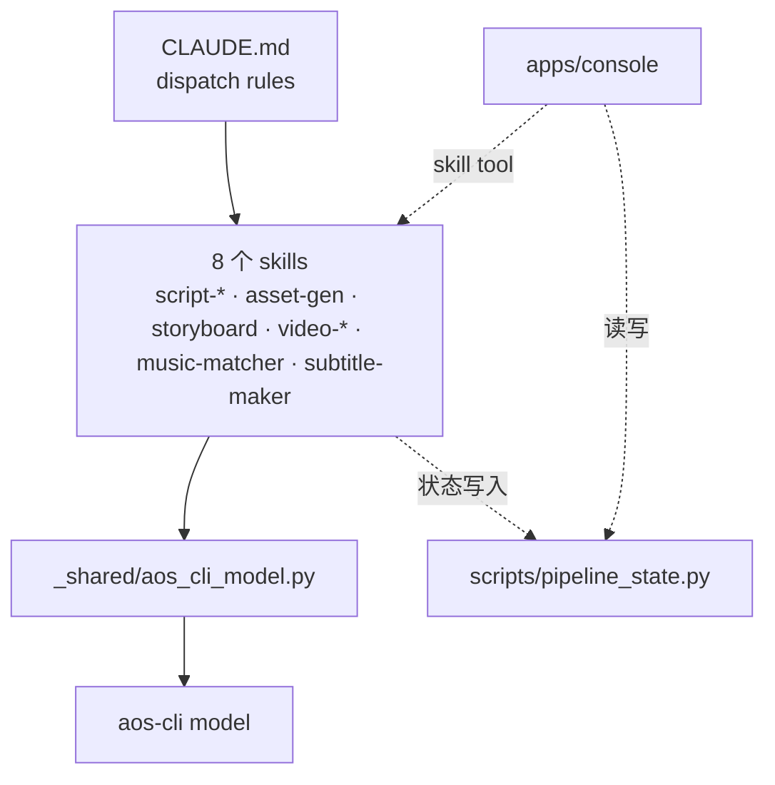

# AgentOS-TS 架构总览

> 飞书文档来源：本仓库 `docs/architecture.md`。所有图统一使用纵向布局，便于飞书白板预览。
> 文档定位：deep wiki 风格的当前架构快照，作为后续整体重构的讨论底稿。

---

## 1. 系统总览

仓库定位：**flat skills 仓库 + 可选的交互控制台**。所有"创作能力"以 skill 形式落在 `.claude/skills/`，skill 内部脚本通过 `aos-cli model` 这一统一 CLI 边界访问外部模型。

要点：
- **Claude Code/Codex 是默认运行时**，Console 只是可选 UI 壳，本身也通过 Agent SDK 间接调度 skills。
- **没有自定义 agent 隔离**——单 session + 全局 MCP + flat skills；并行通过 Claude Code 子 agent 解决。
- **`workspace/{name}/` 是单一事实源**（含 `pipeline-state.json` 与所有产物）。

---

## 2. 分层架构

每层职责一句话：

| 层 | 关键文件 | 职责 |
|---|---|---|
| L1 交互 | `apps/console/server.ts`, CLI | 接收用户意图，建会话 |
| L2 编排 | `orchestrator.ts`, `headless.ts`, `CLAUDE.md` | 把意图映射到 skill / stage 流转 |
| L3 技能 | `.claude/skills/*/SKILL.md` | 单一领域工作流 |
| L4 能力 | `aos-cli/src/aos_cli/model/*` | 模型与媒体的统一调用契约 |
| L5 提供方 | `model/providers/*.py` | 各家 SDK / API 适配 |
| L6 产物 | `workspace/{name}/`, `data/` | 唯一的状态与产物源 |

---

## 3. 流水线阶段图（数据流）

每个黄色 artifact 节点都同时是 **gate**：进入下一 stage 必须先校验文件存在，并在 `pipeline-state.json` 中将上一 stage 标记为 `completed` / `validated`。

---

## 4. Skill 内部结构（通式）

每个 skill 大致结构一致，可视为同一模板的实例：

约束（来自 CLAUDE.md）：
- 模型相关调用一律走 `aos_cli_model.py`，**禁止**新代码直接调用 Gemini / OpenAI / Ark SDK。
- skill 内部使用相对路径 `references/`、`scripts/`；命令示例统一使用仓库根相对路径；`${PROJECT_DIR}` 指当前项目根 `workspace/{name}/`。

---

## 5. 模型边界子系统（`aos-cli`）

边界契约：
- **协议**：`protocol.py` 定义请求 / 响应信封；`errors.py` 提供稳定错误码（`INVALID_REQUEST` / `PROVIDER_REJECTED` / `UNSUPPORTED_CAPABILITY` …）。
- **能力注册**：`capabilities.py` 是「能力 ↔ provider ↔ 模型」的唯一事实源（`generate` / `image` / `video` / `asr` / `embedding` …）。
- **批处理**：`batch.py` 提供 manifest → run_batch → failure_report 的标准批量流程，被 `asset-gen`、`video-gen` 大量复用。

---

## 6. Console 应用子系统

要点：
- **两个入口共用一个 SDK 适配器哲学**：`orchestrator.ts`（WS streaming）与 `headless.ts`（JSON-lines + 自驱续跑），后者由 `scripts/run_pipeline.sh` nohup 拉起。
- **`server.ts` 直接 IO workspace**：编辑策略 (`editPolicy`)、产物动作 (`artifactActions`)、产物校验 (`artifactValidators`) 等"用户编辑可达性"逻辑全在 `src/lib/`。
- **UI 是 thin client**：Chat 走 WS，Navigator / Viewer 走 HTTP 读 workspace 文件。

---

## 7. 状态与持久化模型

状态机：`not_started → running → partial → completed → validated`（`failed` 旁路）。

**state 文件是主状态源，文件存在性是兜底**——`/clear` 之后从 `pipeline-state.json` 重建，缺字段时再回扫产物目录。

---

## 8. 模块依赖关系

观察到的耦合：
- **强耦合（设计意图）**：所有 skill → `_shared/aos_cli_model.py` → `aos-cli`，这是显式的 model boundary。
- **`CLAUDE.md` 同时承担"项目宪章 + 编排说明书"双重角色**——dispatch rules、stage 表、state 协议都在它里面，对运行时和人都生效。这是当前架构最关键的"中央契约"。
- **Console 是可选层但已积累相当多 `lib/` 业务逻辑**（编辑策略、上传引导、storyboard 路径解析、剧情进度），未来若拆分需要明确这些是"通用产物语义"还是"console 专属 UX"。

---

## 9. 后续重构可关注的几个点

1. **`CLAUDE.md` 角色拆分**——目前它既是给人类看的 README，又是给 LLM 用的 dispatch table，又是 state 协议。三种半衰期混在一起，建议拆为：项目宪章（长半衰期）/ 编排手册（中半衰期）/ state 协议（独立 spec，已有 `docs/pipeline-state-contract.md`）。
2. **Console `lib/` 的归属**——`storyboardPaths`、`episodeStatus`、`editPolicy` 等更像"产物语义"而不是"console UI"，可考虑下沉到独立 package。
3. **state 写入面**——目前 skill / console / scripts 三方都写 `pipeline-state.json`，但只有 `pipeline_state.py` 一个 CLI writer，需要确认这条收敛是否被严格执行。
4. **Provider 抽象的边界**——`providers/` 现在是 3 个文件（Gemini / Ark video / OpenAI image），但 capabilities 表上还有 ASR / embedding / chatfire 入口，能力 ↔ provider 的覆盖关系需要核对。
5. **Skills 间的隐式依赖**——例如 `subtitle-maker` 依赖 `script.json` 的名词表、`music-matcher` 依赖剪辑后视频；这些在 `CLAUDE.md` 表里有但没在代码里成型契约。
