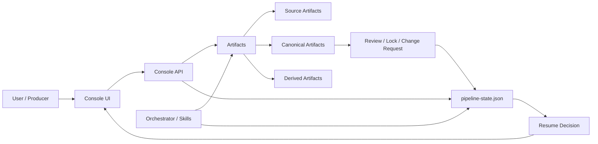
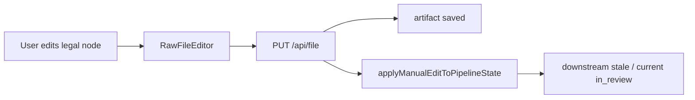
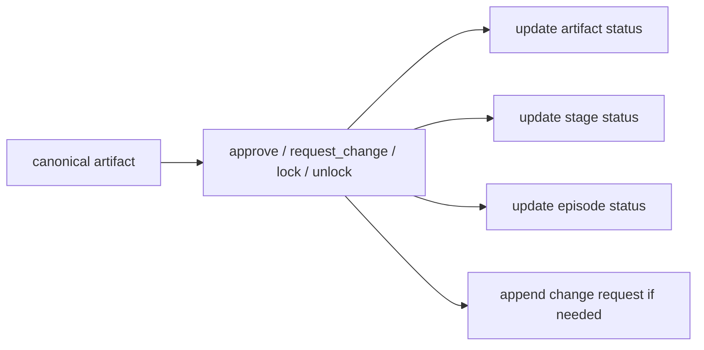
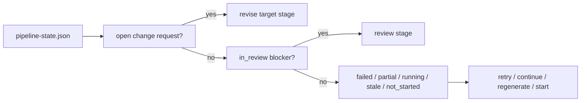
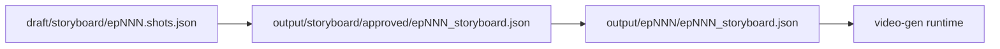

# Architecture Recap and User Adaptation Plan

> Status: active  
> Scope: current production architecture recap, information flow changes, user-facing next plan  
> Priority order: correctness → maintainability → simplicity → extensibility → performance

## Goal

把这一轮架构收敛的结果沉淀成一份可执行共识文档，并从**用户如何实际使用系统**的角度，重新定义下一阶段计划。

这里的核心不是再讨论“skill 怎么拆”“agent 要不要更多”，而是确认三件事：

1. 当前系统的**真实控制骨架**已经变成什么
2. 信息现在是如何在编剧 / 导演 / 制作 / 后期之间流动的
3. 接下来要补什么，才能让用户在新的架构上真正顺手地工作

---

## First Principles Recap

这一轮架构收敛后的根本原则可以压缩为一句话：

> 系统不再以 skill 调用链为中心，而改为以 artifact 和 lifecycle state 为中心。

这意味着：

- 真正的协作单位不是 agent，而是 artifact
- 真正决定“能否继续”的不是文件是否存在，而是它当前的状态是否合法
- 真正的系统边界不是 prompt 约束，而是：
  - 合法编辑点
  - 审核 / 锁版
  - 返修请求
  - 失效传播
  - 最近合法继续点

因此，当前架构的正确抽象是：

**single orchestrator + artifact graph + explicit state model + legal edit points + invalidation rules**

---

## What Actually Changed

### Before

更接近下面这种隐式模型：

```text
user / agent → choose skill → run skill → write files
```

问题是：

- 状态不统一
- 文件存在即默认有效
- 下游可以绕过制度直接改上游
- 用户虽能改文件，但系统不知道哪些结果已经失效
- “继续运行”更像猜测，而不是基于明确业务规则的恢复

### After

现在更接近下面这种显式模型：

```text
user / task → operate legal artifact → write artifact → update pipeline-state
→ mark downstream stale / in_review / change_requested
→ derive next legal action
```

也就是说：

- skill 仍然存在，但它只是执行器
- artifact 成为协作边界
- `pipeline-state.json` 成为跨 skill 的统一控制索引
- 继续运行的起点不再是“最后跑到哪”，而是“最近合法业务节点”

---

## Current Architecture



### Layer Responsibilities

#### 1. Orchestrator / Skills

负责执行任务，但不再充当全局事实源。

它们可以：

- 生成产物
- 更新状态
- 消费已有 canonical artifact

它们不应该再做的事：

- 静默改写已锁版的 canonical artifact
- 用隐式 prompt 规则替代系统级生命周期约束

#### 2. Artifact Graph

`workspace/{project}` 下的文件集合现在承担真正的业务交接。

按角色与语义，当前已经明确分成四类：

- `source`: 人工可介入的输入层
- `canonical`: 下游唯一可信输入
- `derived`: 可重建结果层
- `control`: 生命周期与控制信息

#### 3. State Model

`pipeline-state.json` 现在负责记录：

- stage 当前状态
- episode 子状态
- artifact 生命周期状态
- change request
- next action / current stage

它不是产物本身，但它决定产物是否还能继续被合法消费。

#### 4. Console Control Plane

控制面现在承担的职责是：

- 只开放合法编辑点
- 保存时自动触发失效传播
- 提供 approve / request_change / lock / unlock
- 呈现最近合法继续点

---

## Artifact Taxonomy in Practice

### Source Artifacts

面向创作输入和人工介入：

- `output/inspiration.json`
- `draft/design.json`
- `draft/catalog.json`
- `draft/episodes/ep*.md`
- `output/storyboard/draft/ep*_storyboard.json`

### Canonical Artifacts

面向正式交付与下游消费：

- `output/script.json`
- `output/actors/actors.json`
- `output/locations/locations.json`
- `output/props/props.json`
- `output/storyboard/approved/ep{NNN}_storyboard.json`

### Derived Artifacts

面向执行与结果，不应该成为默认编辑入口：

- `output/ep{NNN}/ep{NNN}_storyboard.json`
- `output/ep{NNN}/ep{NNN}_delivery.json`
- `output/ep{NNN}/**/*.mp4`
- `output/ep{NNN}/*.xml`
- `output/ep{NNN}/*.srt`

### Control Artifacts

- `pipeline-state.json`
- `review/*.json`
- `change-requests/*.json`

---

## Information Flow Changes

## 1. Manual Edit Flow

用户不再“编辑任意文件”，而是：



### Logic

- 前端只在合法路径上启用编辑器
- 服务端保存前再次校验 edit policy
- 保存成功后，当前 artifact 进入 `in_review`
- 其直接下游 stage / episode / artifact 进入 `stale`

这一步的意义是：

> 用户的修改第一次成为“系统级事件”，而不是“磁盘上的匿名改动”。

## 2. Review / Lock / Change Request Flow

当前 canonical artifact 已经进入显式治理：



### Logic

- `approve`: 产物被允许作为下游输入
- `lock`: 产物进入锁版态，禁止继续编辑
- `request_change`: 不直接覆盖，而是向上游发返修请求
- `unlock`: 在制度上重新开放修改

## 3. Resume Flow

继续运行不再从“最后执行到哪”出发，而从“最近合法继续点”出发：



这是这轮收敛最关键的逻辑变化之一：

> 系统终于能基于业务状态告诉用户“下一步应该做什么”。

## 4. Storyboard Contract Flow

分镜从“单文件多语义”变成了双层结构：



### Meaning

- 草稿层：导演工作中可修改
- canonical 层：导演审核通过后的正式锁版输入
- runtime 层：VIDEO 阶段为了连续性、评审元数据、`lsi` 等运行时补写而存在

这意味着：

> 导演锁版和视频运行态第一次被正式分开。

## 5. VIDEO Entry Flow

VIDEO 阶段现在被约束为：

1. 优先读取 approved canonical storyboard
2. 先导出 / 同步到 runtime storyboard
3. 所有运行时补写只发生在 runtime export
4. 不回写导演 canonical

这一步解决的是以前最危险的一类问题：

> VIDEO 执行逻辑会污染导演正式主契约。

---

## What the System Is Now Dominated By

如果从“系统主导概念”来判断，当前仓库已经不再主要由“任务流程”或“skill 编排”主导，而是由下面四层共同主导：

1. **Artifact**：交付物边界
2. **Lifecycle State**：状态与合法性
3. **Role Ownership**：谁负责什么产物
4. **Stage Governance**：审核、锁版、返修、恢复

task / skill 仍然重要，但已经退到执行层。

因此，当前新的核心架构不是：

- task-first
- role-only
- stage-only

而是：

> **artifact-first, state-driven, role-constrained, stage-governed**

---

## User-Centric Analysis

从用户使用角度，不同角色真正关心的不是“现在用了几个 skill”，而是下面这些问题：

### Producer / 主控用户关心

- 这个项目当前卡在哪
- 我下一步该做什么
- 哪些结果已经失效
- 哪些地方可以介入改
- 改完以后系统能不能继续跑

### Writer 关心

- 我能否在自然编辑面修改内容
- 修改后是否能正确触发下游重算
- 我是否需要理解全部下游细节

### Director 关心

- 我能否明确区分草稿、审核通过版本、锁版版本
- VIDEO 阶段会不会反向污染我的分镜主稿
- 下游发现问题时，是否会通过返修请求回流，而不是偷偷改稿

### Production / Video 关心

- 能否拿到稳定、单一、可信的输入
- 运行时补写是否有合法落点
- 中断后是否能正确恢复

### Post / Editing / Music / Subtitle 关心

- 视频输入是否合法
- 上游一旦失效，我是否会被及时标记
- 是否能避免继续在过期产物上工作

---

## What Is Still Missing From the User Perspective

虽然底层骨架已经对了，但从“用户真正上手使用”的角度，仍有几个明显缺口。

### Gap 1: Resume Decision 还只是展示，不是操作入口

系统已经能告诉用户“该 review / revise / retry / regenerate / start 什么”，
但还不能把它变成一个真正顺手的操作入口。

用户现在仍要自己把建议翻译成下一步动作。

### Gap 2: 审核 / 返修 / 锁版 已有制度，但还缺“工作台视角”

当前有动作按钮，但还没有明确的：

- 待审核队列
- 待返修队列
- 已锁版清单

所以制度已经存在，但用户心智上还没形成真正的“生产工作台”。

### Gap 3: 继续运行入口还没和 orchestrator 正式衔接

目前系统已经能做状态判断，但“如何从建议直接继续执行”仍然缺一个最小控制入口。

这不是要侵入 orchestrator 核心，而是要提供：

- command template
- action hint
- stage-scoped run entry

### Gap 4: 服务端制度约束还可以更严格

前端已经只在 canonical 上展示审核动作，
但服务端 `/api/artifact-action` 仍可进一步收紧，避免未来 UI 或脚本绕过制度。

### Gap 5: 变更影响可见性还不够强

当前保存后系统会标记 `stale`，
但用户还缺少一个很直观的“你这次修改会影响哪些下游”的工作流视图。

---

## Next Plan — Adapt the Product to the New Architecture

下面的计划不是从“还缺哪些技术点”出发，而是从“用户在当前架构上怎么工作才顺手”出发。

### P0 — Turn Resume Decision into a Real Entry

**Goal**

让“最近合法继续点”从只读建议变成可执行入口。

**From user perspective**

用户看到“审核 STORYBOARD / 返修 SCRIPT / 重新生成 VIDEO”时，不应该还要自己猜下一步怎么做。

**Minimum adaptation**

- 在 Overview 的 Resume Card 上增加最小动作入口
- 第一版不直接侵入 orchestrator 核心
- 先支持：
  - 复制建议命令
  - 打开目标 artifact
  - 跳到对应工作视图

**Why this matches the new architecture**

因为新架构的核心已经是 `state -> next legal action`，产品层必须把这个决策真正暴露给用户。

### P0 — Add Review / Change Request Inbox

**Goal**

把“审核 / 返修 / 锁版”从分散按钮，提升为用户能理解的治理工作流。

**Minimum adaptation**

- 增加待审核列表
- 增加待返修列表
- 增加已锁版列表

**Why this matches the new architecture**

因为既然已经引入 lifecycle governance，就应该让用户以治理视角工作，而不是只在单文件页面点按钮。

### P1 — Tighten Server-Side Governance

**Goal**

把当前制度约束进一步硬化。

**Minimum adaptation**

- `approve / lock / unlock / request_change` 进一步按 artifact kind / stage 收紧
- 明确哪些动作只能发生在 canonical
- 明确哪些动作不能对 derived artifact 执行

**Why this matches the new architecture**

因为现在系统已经把 artifact 分层了，服务端应该成为最终守门人。

### P1 — Make Impact Visibility Explicit

**Goal**

让用户在编辑前后，清楚知道会影响哪些下游。

**Minimum adaptation**

- 编辑器头部展示受影响 stage
- 保存成功后提供 affected downstream 摘要
- Overview / Navigator 中强化 `stale` 传播的可见性

**Why this matches the new architecture**

因为新架构的核心价值之一就是“修改不会悄悄发生”，而是会触发明确的状态变化。

### P1 — Stage Workbench Instead of Generic File Browser Thinking

**Goal**

把 UI 从“文件浏览器 + 预览器”继续推向“生产工作台”。

**Minimum adaptation**

- SCRIPT：创作 / 审核 / 返修入口
- STORYBOARD：草稿 / canonical / runtime 清晰分层
- VIDEO：runtime storyboard / delivery / clips / episode preview

**Why this matches the new architecture**

因为用户真正按业务节点工作，不按文件树工作。

### P2 — Consistency Hardening

**Goal**

补工程完整性，而不是改变业务模型。

**Possible work**

- `approve` 时文件同步与 state 写入的一致性增强
- artifact-action 的幂等性增强
- 更多恢复场景的 contract tests

**Why this is later**

因为这会提升稳健性，但不如前几个计划直接改善用户工作体验。

---

## Recommended Execution Order

```text
1. Resume entry
2. Review / change-request inbox
3. Server-side governance hardening
4. Impact visibility
5. Stage workbench refinement
6. Consistency hardening
```

这个顺序的原因很简单：

- 先把“状态索引”变成“用户可操作入口”
- 再把“制度”变成“工作台”
- 最后才补内部工程完整性

---

## One-Sentence Conclusion

这轮修改真正完成的，不是“多加了一些状态字段”，而是把系统的控制逻辑从 **skill-first** 改成了 **artifact-and-state-first**。

接下来的计划不应该回到“继续拆 skill / 继续加 agent”的老路，而应该围绕一个目标推进：

> 让用户按新的 artifact + state 架构自然地工作，而不是继续被迫理解底层执行细节。
