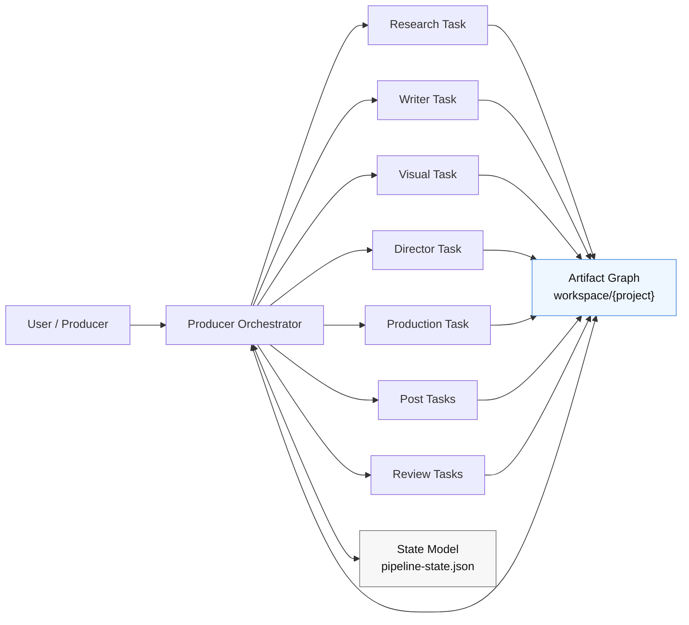

# Production Architecture Design

> Status: proposed  
> Scope: repo architecture, state model, editability model, invalidation model  
> Priority order: correctness → maintainability → simplicity → extensibility → performance

## Goal

将当前仓库从“能跑的 skill 流水线”收敛为“可介入、可返修、可恢复、可持续演进的生产系统”。

这里的“正确”不是指：

- skill 数量更多
- agent 拆得更细
- 阶段文档写得更长

而是指：

- 用户可以在**合法业务节点**介入修改
- 系统可以识别哪些下游产物已经失效
- 系统可以从**最近合法节点**继续运行
- 不同业务角色的边界可被系统约束，而不是只靠提示词自觉

---

## First Principles

### 1. 真实生产协作的单位不是 agent，而是 artifact

编剧、导演、制作、后期之间不是靠共享上下文协作，而是靠交付物协作。

因此系统的第一性原理应为：

**artifact-led, role-constrained, stage-governed, task-executed**

即：

- **Artifact-led**：产物是唯一真相与协作边界
- **Role-constrained**：业务角色决定谁能创建 / 修改 / 审批什么
- **Stage-governed**：阶段决定生命周期、锁版点与返修回流
- **Task-executed**：任务只是生成或校验产物的执行动作

### 2. “任意节点可修改”是伪需求

正确需求不是“任意文件任意修改后都能继续跑”，而是：

> 用户可以在任意**合法业务节点**介入，系统能识别失效链，并从最近合法节点继续。

### 3. 文本剧本不是全流程唯一真相

编剧需要友好的 authoring surface；下游需要稳定的 canonical contract。

因此：

- `draft/episodes/*.md` 是**作者输入层**
- `output/script.json` 是**结构化主契约**

同理：

- storyboards 的草稿格式可以服务导演工作
- 但进入视频生成阶段之前，必须存在稳定的 canonical storyboard contract

### 4. 阶段边界不等于进程边界

业务角色、阶段、task、agent 不是同一层概念。

- 角色是责任模型
- 阶段是生命周期模型
- task 是执行模型
- agent/subagent 是实现手段

不应该用“多常驻 agent”去替代“业务边界 + 锁版 + 返修制度”。

---

## Non-Goals

本设计明确**不追求**以下目标：

- 不把系统改造成多常驻部门 agent
- 不重写全部 skill
- 不引入新的数据库或复杂 workflow engine
- 不发明新的 DSL 替换现有剧本文本格式
- 不让所有中间产物都成为人工编辑入口

---

## Architecture Decision

### Decision

采用 **single orchestrator + artifact graph + explicit state model + legal edit points + invalidation rules**。

### Why

这条路线是最小、最稳、最符合真实生产的改动：

- 保留现有 `workspace/{project}` 单项目根目录
- 保留现有 skill 体系
- 不强推多 agent
- 先补齐真正缺失的制度层：主契约、锁版、变更传播、返修

### Rejected Alternatives

- **长期多 agent / 多 workspace 架构**：复杂度高，不能从根本上解决返修与锁版
- **继续沿用单 session + 提示词约束**：短期快，长期边界继续腐化
- **把文本剧本继续当成下游唯一输入**：对人工友好，对机器与状态传播不友好

---

## Target Model



关键原则：

1. orchestrator 是唯一常驻控制面
2. worker/task 不互相直接通信
3. 所有协作都通过 artifact graph 发生
4. 所有继续运行都通过 state model 决定

---

## Artifact Taxonomy

系统内的产物分四类。

### A. Source Artifacts

人可编辑、表达业务意图的输入层。

| Artifact | Owner Role | Editable | Purpose |
| --- | --- | --- | --- |
| `source.txt` | producer / writer | limited | 原始输入副本 |
| `output/inspiration.json` | research | yes | 题材与市场输入 |
| `draft/design.json` | writer | yes | 剧本设计与集数结构 |
| `draft/catalog.json` | writer / visual | yes | 角色、地点、道具权威清单 |
| `draft/episodes/ep*.md` | writer | yes | 编剧作者输入面 |
| `output/storyboard/draft/ep*_storyboard.json` | director | yes | 导演分镜草稿 |

### B. Canonical Artifacts

下游唯一可信输入。任何生成、恢复、继续都应优先依赖它们。

| Artifact | Owner Role | Editable | Purpose |
| --- | --- | --- | --- |
| `output/script.json` | writer | guarded | 结构化剧本主契约 |
| `output/actors/actors.json` | visual | guarded | 角色资产主契约 |
| `output/locations/locations.json` | visual | guarded | 场景资产主契约 |
| `output/props/props.json` | visual | guarded | 道具资产主契约 |
| `output/storyboard/approved/ep{NNN}_storyboard.json` | director | guarded | 已批准分镜主契约 |

> 当前仓库已落地独立的 approved storyboard canonical contract；原 `output/ep{NNN}/ep{NNN}_storyboard.json` 继续作为 VIDEO 运行时导出层保留。

### C. Derived Artifacts

由 canonical/source 计算得到，可重建，不应作为首选人工编辑入口。

| Artifact | Editable | Purpose |
| --- | --- | --- |
| `output/ep{NNN}/ep{NNN}_storyboard.json` | no | 视频生成输入导出 |
| `output/ep{NNN}/ep{NNN}_delivery.json` | no | 视频生成结果摘要 |
| `output/ep{NNN}/**/*.mp4` | no | 视频产物 |
| `output/ep{NNN}/*.xml` / `*.srt` | no | 后期产物 |

### D. Control Artifacts

控制系统行为，不承载创意内容。

| Artifact | Purpose |
| --- | --- |
| `pipeline-state.json` | 生命周期、锁版、失效、继续运行 |
| `review/*.json` | 审核结果 |
| `change-requests/*.json` | 下游回流到上游的返修请求 |

---

## Legal Edit Points

不是所有产物都允许编辑。只开放少量合法业务节点。

### Allowed

| Artifact | Why |
| --- | --- |
| `output/inspiration.json` | 研究结论可人工修订 |
| `draft/design.json` | 剧本设计层必须允许介入 |
| `draft/catalog.json` | 角色 / 场景 / 道具权威表必须允许介入 |
| `draft/episodes/*.md` | 编剧自然编辑面 |
| `output/script.json` | 编译后的 canonical 剧本，需要受控编辑 |
| `output/storyboard/draft/*_storyboard.json` | 导演分镜草稿编辑面 |
| approved storyboard canonical contract | 视频前最后导演锁版点 |

### Disallowed

| Artifact | Why |
| --- | --- |
| `delivery.json` | 应由系统生成，不应手工改结果摘要 |
| `mp4` / `xml` / `srt` derived outputs | 这些是产出物，不是业务主契约 |
| 任意未知 `output/**/*.json` | 防止漂移出新的隐形主契约 |

---

## Invalidation Rules

本系统当前最大的缺口是：修改了上游，系统不知道哪些下游已经失效。

必须显式建立失效传播规则。

### Core Rule

> 修改 source/canonical artifact 后，所有依赖它的下游 canonical/derived artifact 必须被标记为 `stale` 或 `change_requested`，不能继续假装有效。

### Minimum Rules

| Modified Artifact | Invalidates |
| --- | --- |
| `output/inspiration.json` | `design`, `catalog`, `script`, `storyboard`, `video`, `post` |
| `draft/design.json` | `catalog`, `script`, `storyboard`, `video`, `post` |
| `draft/catalog.json` | `script`, `visual`, `storyboard`, `video`, `post` |
| `draft/episodes/*.md` | `output/script.json`, `storyboard`, `video`, `post` |
| `output/script.json` | `storyboard`, `video`, `post` |
| `output/storyboard/draft/*_storyboard.json` | `output/storyboard/approved/ep{NNN}_storyboard.json`, `video`, `post` |
| `output/storyboard/approved/ep{NNN}_storyboard.json` | `video`, `post` |
| assets canonical (`actors/locations/props`) | `storyboard`, `video`, `post` |

### Notes

- 失效不是删除文件
- 失效是状态改变
- 旧文件保留用于审计与回溯

---

## Resume Principle

继续运行不是“从最后一次任务断点继续”，而是：

> 从最近合法、未被上游推翻、且已经满足前置审核条件的业务阶段继续。

这意味着：

- `in_review` 先 review，不继续下游
- `change_requested` 先 revise，不继续下游
- `stale` 先 regenerate 本阶段，不跳过到下游
- `failed` / `partial` / `running` 回到当前阶段继续
- 只有当前置 stage 处于 `approved` / `locked` / `validated` / `completed` 时，下游 stage 才能成为建议继续点

---

## State Model

现有状态模型不够表达真实生产，需要扩展。

### Keep

- `not_started`
- `running`
- `partial`
- `failed`
- `completed`
- `validated`

### Add

- `in_review`
- `approved`
- `locked`
- `change_requested`
- `stale`
- `superseded`

### Semantics

| Status | Meaning |
| --- | --- |
| `in_review` | 产物已生成，等待审核 |
| `approved` | 审核通过，可作为下游输入 |
| `locked` | 明确锁版，下游不得静默修改 |
| `change_requested` | 下游或审查方要求上游返修 |
| `stale` | 上游变化导致当前产物不再可信 |
| `superseded` | 被更新版本替代，保留作历史 |

### Required Additions to `pipeline-state.json`

建议新增：

```json
{
  "artifacts": {
    "output/script.json": {
      "kind": "canonical",
      "owner_role": "writer",
      "status": "approved",
      "revision": 3,
      "depends_on": [
        "draft/design.json",
        "draft/catalog.json",
        "draft/episodes/ep001.md"
      ],
      "invalidates": [
        "output/storyboard/draft/ep001_storyboard.json",
        "output/ep001/ep001_storyboard.json"
      ]
    }
  },
  "change_requests": []
}
```

---

## Review and Lock Model

真实生产里，返修和锁版比“继续跑”更重要。

### Mandatory Review Gates

至少需要三个显式关口：

1. **Script Review**
2. **Storyboard Review**
3. **Video Review**

### Lock Points

至少需要：

1. `script lock`
2. `storyboard lock`
3. `final lock`

### Rule

下游不得静默改上游。

如果 `video` 阶段发现 storyboards 有问题，正确动作不是直接改 storyboards，而是创建 `change request`，由 orchestrator 回流到 director owner。

---

## Orchestrator Responsibilities

orchestrator 必须从“消息透传层”升级成“生产控制面”。

### Must Do

- 读取 state model
- 判断当前可进入阶段
- 判断哪些 artifacts 已 stale
- 判断用户当前修改是否合法
- 触发 review / lock / change request
- 在需要时派发 worker
- 在恢复时选择最近合法节点而不是盲目继续

### Must Not Do

- 不直接承担创作
- 不把自己做成巨型业务逻辑 skill
- 不悄悄篡改业务产物

---

## Worker Model

worker/subagent 只在以下三类场景使用：

1. **长任务**
2. **高 context 压力**
3. **天然并行**

例如：

- 多集剧本写作
- 多集视频生成
- 独立 review 任务

不使用 worker 来模拟“长期部门角色”。

---

## Minimal Implementation Plan

### Phase 1 — Define the artifact graph

**Goal:** 先让系统知道“什么是主契约，什么可编辑，什么可失效”。

**Files:**

- Update `docs/pipeline-state-contract.md`
- Create `docs/artifact-graph.md` or fold into contract docs
- Create this design doc as source plan

**Deliverables:**

- artifact taxonomy
- legal edit points
- invalidation table
- expanded status model

### Phase 2 — Expand state model without new infra

**Goal:** 不引入数据库，直接扩展现有 `pipeline-state.json`。

**Files:**

- Update `docs/pipeline-state-contract.md`
- Update `docs/pipeline-state.example.json`
- Update readers/writers that touch state

**Deliverables:**

- new statuses
- artifact-level metadata
- change request list

### Phase 3 — Make editability explicit

**Goal:** console 不再只是“能写 output json”，而是“只允许写合法业务节点”。

**Files:**

- Update `apps/console/server.ts`
- Update `apps/console/src/lib/schemaDetect.ts`
- Update editor/viewer wiring under `apps/console/src/`

**Deliverables:**

- whitelist by artifact type, not by broad path
- guarded edits for canonical artifacts
- disallow direct editing of derived artifacts

### Phase 4 — Add invalidation propagation

**Goal:** 改一个上游产物时，自动标记所有受影响下游。

**Files:**

- Update `apps/console/server.ts`
- Update `apps/console/src/orchestrator.ts`
- Add a small invalidation utility module

**Deliverables:**

- revision bump
- stale propagation
- continue-from-nearest-legal-node

### Phase 5 — Add explicit review/lock/change-request flow

**Goal:** 把返修制度做成系统动作。

**Files:**

- Update `docs/pipeline-state-contract.md`
- Update `apps/console/src/orchestrator.ts`
- Add review/change-request artifact handling

**Deliverables:**

- review statuses
- lock statuses
- change request artifacts

### Phase 6 — Normalize canonical storyboard contract

**Goal:** 在导演草稿和视频导出之间补齐缺失的 canonical layer。

**Files:**

- Add storyboard contract doc
- Update `storyboard` skill docs
- Update `video-gen` ingestion path

**Deliverables:**

- director-friendly draft format kept
- production-facing approved storyboard contract added

---

## Acceptance Criteria

本设计落地后，系统必须满足：

1. 用户修改任一**合法业务节点**后，系统能自动标记受影响下游为 `stale`
2. orchestrator 能从最近合法节点继续，而不是从头或从错误阶段盲跑
3. 文本剧本与 `script.json` 的职责边界清晰：前者 authoring，后者 canonical
4. 下游阶段不能静默修改上游主契约
5. 至少有 script/storyboard/video 三个 review gate
6. 不引入新的复杂运行时或 workflow engine

---

## Risks

### Risk 1: 过度设计

如果一开始就加太多 artifact 类型、状态、review 角色，系统会变重。

**Mitigation:** 只做最小状态扩展，只覆盖当前已有关键产物。

### Risk 2: 新旧 contract 并存漂移

如果文本格式、解析器、状态契约、UI 编辑入口各自演化，会继续漂。

**Mitigation:** 明确“文本剧本不是唯一真相”，下游统一认 canonical artifact。

### Risk 3: 把 derived artifact 误当 editable

会造成更多隐形状态。

**Mitigation:** UI 层和 API 层同时限制编辑入口。

---

## Verification Plan

### Design Verification

- 检查每个业务角色是否有清晰 owner artifact
- 检查每个可编辑节点是否有明确 invalidates 规则
- 检查每个下游阶段是否只依赖 canonical artifact

### Implementation Verification

- 修改 `design.json` 后，`script/storyboard/video` 被标记为 `stale`
- 修改 `script.json` 后，`storyboard/video/post` 被标记为 `stale`
- 修改 approved storyboard 后，`video/post` 被标记为 `stale`
- UI 禁止直接修改 `delivery.json` / `mp4` 等 derived artifact
- orchestrator 能基于状态选择正确恢复点

---

## Final Summary

当前系统真正缺的不是更多 skill，也不是更多 agent。

真正缺的是五件事：

1. **统一的 artifact graph**
2. **明确的合法编辑节点**
3. **显式的 invalidation rules**
4. **足够表达生产行为的 state model**
5. **review / lock / change request 的制度化控制面**

这五件事补齐之后，现有 skill 体系才会从“能跑”变成“能长期生产”。
