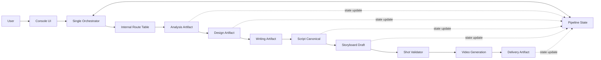

# Templates Skill Alignment Implementation Plan

> **For Claude:** REQUIRED SUB-SKILL: Use superpowers:executing-plans to implement this plan task-by-task.

**Goal:** 将 `/Users/dingzhijian/lingjing/e2b-claude-agent/templates` 中高价值、长半衰期的 skill 逻辑选择性对齐到当前项目，同时不破坏当前 single orchestrator、artifact-driven、pipeline-state 架构。

**Architecture:** 当前项目继续以单 orchestrator 作为控制面，以 `workspace/{project}` artifact graph 和 `pipeline-state.json` 作为协作真相源。`templates` 只作为能力来源，不作为架构模板；迁移顺序必须先文档化、再影子路由、再契约化中间产物，最后才允许改执行路径。

**Tech Stack:** Claude Agent SDK console, repo-local `.claude/skills`, Markdown contracts, JSON artifacts, TypeScript console/orchestrator, Python skill scripts.

---

## Status

Proposed.  
Do not implement runtime behavior changes until the user explicitly approves execution.

## First-Principles Decision

唯一事实标准不是现有项目结构，也不是 `templates` 的阶段划分，而是真实业务生产流程：

1. 编剧、导演、制作之间通过交付物协作，不通过共享上下文协作。
2. 系统正确性的核心是 artifact 是否可审阅、可修改、可锁版、可续跑。
3. agent、skill、stage 都只是实现手段，不能反过来主导业务边界。
4. 任何迁移如果削弱用户在合法节点介入修改并继续运行的能力，都应拒绝。

因此，本计划采用：

> select contracts and rules, not shells and workflows

也就是：吸收 `templates` 的契约、路由、规则、校验思想；拒绝吸收它的多阶段壳、多目录壳、卡片推进壳。

## Hard Non-Movable Boundaries

以下内容是当前项目的核心骨架，本计划不得侵害：

| Boundary | Decision |
| --- | --- |
| Single orchestrator | 保留唯一常驻控制面，不引入长期多 agent 架构 |
| Claude Agent SDK console | 保留当前会话与 UI 控制流，不让模板阶段壳接管 |
| Artifact-driven workspace | 保留 `workspace/{project}` 作为项目真相源 |
| `pipeline-state.json` | 保留生命周期、合法继续点、失效传播的控制职责 |
| Existing skills | 不整体替换，不批量重命名，不复制第二套事实源 |
| User editability | 不降低用户在合法业务节点介入修改并续跑的能力 |

## Absorption Matrix

| Source from templates | Decision | Why |
| --- | --- | --- |
| `1_script/.claude/skills/script-router/router.yaml` | Absorb as internal route table | 把入口判断从自然语言提示词变成可审计规则 |
| `script-router/schema/*.json` | Absorb selectively | 用于定义 route input/output，不直接替换当前 script format |
| `analysis-* -> strategy-* -> script-writing-core` boundary | Absorb concept, not directory layout | 需要的是 analysis/design/writing artifact 边界，不是更多壳 |
| `script-writing-core/references/outline-contract.md` | Absorb | 补齐 outline/design 交接契约 |
| `script-writing-core/references/output-contract.md` | Absorb | 冻结下游可解析输出边界 |
| `storyboard-generate/references/MODE_RULES.md` | Absorb | 视频侧用户选择、续跑、连续性规则需要显式化 |
| `storyboard/video validator ideas` | Absorb lightly | 当前需要轻量校验器，不需要复制重型历史债 |
| `0_inspiration` to `5_post` stage shells | Reject | 多阶段目录壳会破坏当前单控制面 |
| `stage-suggest` card flow | Reject | 前端卡片不应成为业务流程事实源 |
| Multi-workspace cloned tree | Reject | 与当前多项目 workspace 隔离模型冲突 |

## Target Information Flow

关键点：

- route table 只帮助 orchestrator 判断“应该走哪类创作路径”。
- analysis/design/writing 是 artifact 边界，不必一开始拆成三个常驻 agent。
- validator 是进入昂贵视频生成前的导演/制作交接检查，不是第二套创作系统。
- 所有 task/subagent 的通信仍然只通过落盘 artifact 和 `pipeline-state.json` 完成。

## Migration Phases

### Phase 0: Document Guardrails Only

**Intent:** 先冻结共识，防止后续迁移误伤核心骨架。

**Files:**
- Create: `docs/plans/2026-04-23-templates-skill-alignment.md`
- Later consider: `docs/templates-alignment-decision.md`

**Steps:**
1. Record absorption matrix.
2. Record hard non-movable boundaries.
3. Record phased migration order.
4. Do not change runtime code.

**Verification:**
- Run: `git diff -- docs/plans/2026-04-23-templates-skill-alignment.md`
- Expected: only this planning document is added.

### Phase 1: Add Shadow Router, No Behavior Change

**Intent:** 引入显式路由表，但只做审计与解释，不接管现有执行。

**Files:**
- Create: `.claude/skills/script-adapt/references/route-table.md`
- Create: `.claude/skills/script-adapt/references/route-table.schema.json`
- Modify: `.claude/skills/script-adapt/SKILL.md`
- Modify: `.claude/skills/script-writer/SKILL.md`

**Steps:**
1. Translate relevant `templates` route concepts into current project terminology.
2. Define route dimensions: input type, source length, originality, adaptation intensity, expected artifacts.
3. Add a shadow-router section to skill docs.
4. Require the skill to explain chosen route before execution.
5. Do not change which skill is invoked by the orchestrator.

**Verification:**
- Use three representative inputs: long novel, short expansion, original idea.
- Expected: selected route explanation matches current intended skill behavior.
- Expected: no output path changes.

### Phase 2: Make Script Middle Artifacts Explicit

**Intent:** 解决 `script-adapt` 过于包揽的问题，但不急着拆 skill。

**Files:**
- Create: `.claude/skills/script-adapt/references/design-contract.md`
- Create: `.claude/skills/script-adapt/references/outline-contract.md`
- Modify: `.claude/skills/script-adapt/references/phase1-design.md`
- Modify: `.claude/skills/script-adapt/references/phase2-writing.md`
- Modify: `.claude/skills/script-adapt/references/phase3-extraction.md`
- Modify only if needed: `.claude/skills/script-adapt/scripts/prepare_source_project.py`

**Steps:**
1. Define `draft/design.json` or equivalent design artifact as the writer handoff.
2. Define what analysis may include and what writing may consume.
3. Define what fields downstream video and asset skills can rely on.
4. Keep `script-format.md` as the current canonical output reference.
5. Avoid replacing the existing parser unless a concrete parsing failure requires it.

**Verification:**
- Run existing script-adapt sample flow if available.
- Expected: current output contract remains compatible with downstream consumers.
- Expected: the new design/outline docs clarify behavior without forcing a rewrite.

### Phase 3: Add Video Mode Rules and Lightweight Validation

**Intent:** 把导演到制作的交接规则显式化，降低昂贵视频生成前的结构性失败。

**Files:**
- Create: `.claude/skills/video-gen/references/MODE_RULES.md`
- Create: `.claude/skills/video-gen/references/SHOT_VALIDATION_RULES.md`
- Modify: `.claude/skills/video-gen/SKILL.md`
- Modify only after approval: `.claude/skills/video-gen/scripts/generate_episode_json.py`
- Modify only after approval: `.claude/skills/video-gen/scripts/storyboard_batch.py`

**Steps:**
1. Define supported modes: prompt only, video only, prompt plus video, resume.
2. Define when to reuse existing storyboard and when to regenerate.
3. Define continuity reference rules in business language.
4. Add lightweight validation rules for shot count, required fields, character references, location references, and duration.
5. Keep validator small and transparent; reject copying a heavy historical validator wholesale.

**Verification:**
- Use one existing episode storyboard artifact.
- Expected: validation can explain pass/fail in user-facing language.
- Expected: video generation behavior remains unchanged until validator is explicitly wired in.

### Phase 4: Activate Only Proven Boundaries

**Intent:** 只有当影子规则稳定并且能减少真实错误时，才让它们接管执行。

**Files:**
- Modify: `apps/console/src/orchestrator.ts`
- Modify: `apps/console/server.ts`
- Modify: `.claude/skills/script-adapt/SKILL.md`
- Modify: `.claude/skills/video-gen/SKILL.md`
- Modify related tests under `apps/console/test/`

**Steps:**
1. Choose one boundary to activate at a time.
2. Add or update tests before behavior changes.
3. Wire shadow router into status/explanation first, not execution.
4. Wire validator as a preflight warning first, not hard blocker.
5. Promote to hard gate only after sample projects prove the rule is stable.

**Verification:**
- Run focused tests for route explanation, resume policy, artifact lifecycle, and storyboard validation.
- Run a small E2E flow from upload to one episode video generation when approved.
- Expected: user can still intervene at legal artifact nodes and continue downstream.

## Explicit Rejections

Do not do these unless a future architecture decision reverses this plan:

1. Do not copy `templates/.claude/CLAUDE.md` stage shell into this repo.
2. Do not introduce `0_inspiration`, `1_script`, `2_asset`, `3_footage`, `4_editing`, `5_post` as runtime directories.
3. Do not make stage cards the source of truth for progress.
4. Do not replace current `.claude/skills` with template skill directories.
5. Do not make skills communicate through chat context instead of artifacts.
6. Do not add a workflow engine or database to solve what `pipeline-state.json` can already model.

## Acceptance Criteria

The alignment is successful only if all are true:

1. Current single orchestrator remains the control plane.
2. Existing artifact paths remain valid unless explicitly migrated with compatibility.
3. Route decisions become more auditable without making the user choose implementation details.
4. Script middle artifacts become clearer without forcing a full rewrite.
5. Video generation becomes safer before expensive execution.
6. User editability and resume behavior improve or remain unchanged.
7. No duplicated skill fact source is introduced.

## Risk Controls

| Risk | Control |
| --- | --- |
| Accidentally copying template architecture | Treat templates as reference material only |
| Over-splitting skills | Split only when artifact boundary is independently valuable |
| Breaking current users | Start with docs and shadow mode |
| Schema churn | Preserve current canonical contracts first |
| Validator becoming historical debt | Keep validation explainable and small |

## Execution Gate

Implementation should not start from this document automatically.

Before runtime changes, require a separate user approval that names the phase to execute, for example:

- Execute Phase 1 only
- Execute Phase 2 only
- Execute Phase 3 only

Optional checkpoint commits must not be created unless the user explicitly asks for commits.
