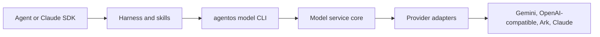

# AgentOS CLI Model Service Spec

> Status: proposed  
> Scope: new infrastructure project `/Users/dingzhijian/lingjing/agentos-cli`  
> Priority order: correctness -> maintainability -> simplicity -> extensibility -> performance

## 1. 根本目标

`agentos-cli` 是 AgentOS 后续 pipeline 的基础设施 CLI。第一版只实现模型能力服务，不实现 pipeline runtime。

核心目标是把 AgentOS 的业务编排层从供应商 API 细节中隔离出来：

- Agent / Claude Agent SDK 只负责推理与工具调用。
- Harness / skills 只负责阶段状态、artifact 生命周期、人工确认、重试策略。
- `agentos-cli` 只负责一次原子化模型能力调用，并返回稳定机器契约。
- Provider adapter 只负责 Gemini / OpenAI-compatible / Ark / Claude 等供应商协议差异。

一句话边界：

> `agentos-cli` 是模型能力防腐层，不是 workflow engine。

## 2. 真实问题

当前项目里的模型调用散落在多个 skill 脚本里，导致三个系统性风险：

1. 供应商细节泄漏到业务阶段。比如脚本直接知道 Gemini proxy、OpenAI-compatible image、Ark video 的认证和 payload 形状。
2. 输出成功标准不一致。某些调用只检查 HTTP 200 或非空文本，无法保证后续机器消费安全。
3. preflight 不够真实。环境变量存在或 HTTP 200 不等于模型可用，HTML 首页、鉴权失败、额度耗尽都必须被明确识别。

要解决的不是“少写几个 SDK 调用”，而是建立稳定协议：

- 输入可审计。
- 输出可验证。
- 错误可分类。
- 底层 provider 可替换。
- harness 调用方式不变。

## 3. 非目标

第一版明确不做：

- 不接管 `SCRIPT / VISUAL / STORYBOARD / VIDEO` 阶段状态。
- 不写 `pipeline-state.json`。
- 不决定哪一集、哪一场、哪个资产先生成。
- 不管理人工审核、锁版、返修、失效传播。
- 不做长期任务队列系统。
- 不做 Web console。
- 不把 LiteLLM 或任何 provider response 直接暴露给 pipeline。

## 4. 项目命名

项目名：

```text
agentos-cli
```

可执行命令：

```text
agentos
```

第一版命名空间：

```text
agentos model ...
```

推荐调用方式：

```bash
agentos model run --input request.json --output response.json
agentos model preflight --json
agentos model capabilities --json
```

后续可以扩展：

```bash
agentos model serve --port 8787
agentos model video submit --input request.json --output task.json
agentos model video poll --input task.json --output result.json
```

## 5. 架构边界



### 5.1 Core service

Core service 负责：

- request envelope 解析。
- model policy 解析。
- provider routing。
- prompt / payload normalization。
- JSON output validation。
- structured repair / retry。
- provider error normalization。
- usage / latency / model metadata 归一化。

### 5.2 CLI interface

CLI 负责：

- 读取 request JSON。
- 调用 core service。
- 写 response JSON。
- stdout 只输出 JSON 或保持空。
- stderr 输出人类日志。
- exit code 表示进程级成功或失败。

### 5.3 Provider adapters

Provider adapter 负责：

- Gemini generateContent 格式。
- OpenAI-compatible image generation 格式。
- Ark video submit / poll 格式。
- Claude text/vision 格式。

Provider adapter 不负责：

- 业务 stage 判断。
- artifact 生命周期。
- pipeline 状态写回。

## 6. 能力模型

第一版能力只保留最小集合。

| Capability | Output kind | 用途 | 同步性 |
|---|---|---|---|
| `generate` | `text` | 灵感扩写、说明、摘要、人类可读草稿 | sync |
| `generate` | `json` | 分镜、资产分析、剧情拆解、结构映射 | sync |
| `image.generate` | `artifact` | 角色、场景、道具图片 | sync for v1 |
| `vision.analyze` | `json` | 图片/视频审核、提示词符合度分析 | sync |
| `video.submit` | `task` | Ark / video provider 长任务提交 | async |
| `video.poll` | `task_result` | 查询视频任务状态 | async |

第一版推荐先实现：

- `generate + text`
- `generate + json`
- `preflight`
- `capabilities`

`image.generate` 第二批接入。`video.submit/poll` 不要塞进同步 `run`，因为视频生命周期天然是长任务。

## 7. Request contract

所有 `agentos model run` 输入都使用同一 envelope。

```json
{
  "apiVersion": "agentos.model/v1",
  "task": "storyboard.scene",
  "capability": "generate",
  "output": {
    "kind": "json",
    "schema": "storyboard.scene.v1"
  },
  "modelPolicy": {
    "tier": "fast",
    "provider": "auto",
    "model": null
  },
  "input": {
    "system": "You are a storyboard director.",
    "content": {
      "scene": {},
      "style": {}
    }
  },
  "options": {
    "temperature": 0.6,
    "maxOutputTokens": 2000,
    "timeoutSeconds": 180
  }
}
```

### 7.1 Required fields

| Field | Required | Meaning |
|---|---:|---|
| `apiVersion` | yes | Protocol version. First version is `agentos.model/v1`. |
| `task` | yes | Stable task label for logs and routing hints. It is not a pipeline stage. |
| `capability` | yes | Atomic model capability. |
| `output.kind` | yes | Output contract: `text`, `json`, `artifact`, `task`, `task_result`. |
| `input` | yes | Provider-independent input payload. |

### 7.2 Model policy

`modelPolicy` is a preference, not a stable API dependency.

```json
{
  "tier": "fast",
  "provider": "auto",
  "model": null
}
```

Allowed `tier` values:

- `fast`
- `balanced`
- `quality`
- `vision`
- `image`
- `video`

Harness may set `provider` or `model` for experiments, but production logic must not depend on provider-specific response shape.

## 8. Response contract

Success response:

```json
{
  "ok": true,
  "apiVersion": "agentos.model/v1",
  "task": "storyboard.scene",
  "capability": "generate",
  "output": {
    "kind": "json",
    "data": {},
    "validated": true,
    "schema": "storyboard.scene.v1"
  },
  "provider": "gemini",
  "model": "gemini-3.1-flash-lite",
  "usage": {
    "inputTokens": 0,
    "outputTokens": 0
  },
  "latencyMs": 0,
  "warnings": []
}
```

Failure response:

```json
{
  "ok": false,
  "apiVersion": "agentos.model/v1",
  "task": "storyboard.scene",
  "capability": "generate",
  "error": {
    "code": "PROVIDER_AUTH_FAILED",
    "message": "Configured API key is invalid for the selected base URL.",
    "retryable": false,
    "provider": "gemini",
    "statusCode": 401
  },
  "warnings": []
}
```

## 9. text 与 json 的边界

`text` 和 `json` 不应该拆成两个服务类，也不应该作为两个核心入口命令。它们是同一个 `generate` capability 下的两个输出契约：

```json
{
  "capability": "generate",
  "output": {
    "kind": "text"
  }
}
```

```json
{
  "capability": "generate",
  "output": {
    "kind": "json",
    "schema": "asset.analysis.v1"
  }
}
```

差异在 core service 内部：

- `text` 只校验非空字符串。
- `json` 必须解析 JSON、校验 schema、必要时 repair/retry。
- `json` 失败必须返回结构化错误，不能把清洗责任泄漏给 harness。

## 10. Error taxonomy

错误码必须稳定，provider 原始错误只能作为 metadata。

| Code | Retryable | Meaning |
|---|---:|---|
| `INVALID_REQUEST` | false | Request envelope 不合法。 |
| `UNSUPPORTED_CAPABILITY` | false | 当前服务不支持该 capability。 |
| `SCHEMA_NOT_FOUND` | false | 请求的 schema 不存在。 |
| `OUTPUT_PARSE_FAILED` | true | 模型返回无法解析为目标输出。 |
| `OUTPUT_SCHEMA_FAILED` | true | JSON 可解析但 schema 不通过。 |
| `PROVIDER_AUTH_FAILED` | false | API key / base URL 不匹配或无权限。 |
| `PROVIDER_QUOTA_EXHAUSTED` | true | 额度耗尽或限流。 |
| `PROVIDER_TIMEOUT` | true | 请求超时。 |
| `PROVIDER_BAD_RESPONSE` | true | 返回 HTML、空响应、缺字段等。 |
| `PROVIDER_UNSUPPORTED_MODEL` | false | 模型名不可用。 |
| `ARTIFACT_WRITE_FAILED` | false | 输出 artifact 写盘失败。 |

## 11. Preflight contract

Preflight 必须做真实 API 探测，不允许只检查 env 是否存在。

`agentos model preflight --json` 返回：

```json
{
  "ok": true,
  "checks": [
    {
      "name": "gemini.generate",
      "ok": true,
      "provider": "gemini",
      "model": "gemini-3.1-flash-lite",
      "latencyMs": 0
    }
  ],
  "warnings": []
}
```

必须识别：

- missing env。
- key 格式与 base URL 明显不匹配。
- HTTP 200 但响应是 HTML。
- HTTP 401 / 403 鉴权失败。
- HTTP 402 / 429 额度或限流。
- model 不存在。
- JSON endpoint 返回非 JSON。

## 12. Env naming

环境变量按模型生态或协议命名，不按代理供应商品牌命名。

```bash
GEMINI_API_KEY=...
GEMINI_BASE_URL=https://api.chatfire.cn/gemini
GEMINI_TEXT_MODEL=gemini-3.1-flash-lite

OPENAI_API_KEY=...
OPENAI_BASE_URL=https://api.chatfire.cn
OPENAI_IMAGE_MODEL=gpt-image-2

CLAUDE_API_KEY=...
ARK_API_KEY=...
```

规则：

- 代理供应商只体现在 `BASE_URL`。
- 业务层不得依赖代理供应商品牌。
- CLI response 可以记录实际 provider adapter 名称，供审计使用。

## 13. Capabilities endpoint

`agentos model capabilities --json` 返回当前安装和配置能支持什么。

```json
{
  "apiVersion": "agentos.model/v1",
  "capabilities": [
    {
      "name": "generate",
      "outputKinds": ["text", "json"],
      "providers": ["gemini"],
      "models": ["gemini-3.1-flash-lite"]
    },
    {
      "name": "image.generate",
      "outputKinds": ["artifact"],
      "providers": ["openai_compatible"],
      "models": ["gpt-image-2"]
    }
  ]
}
```

Harness 应该读取 capabilities，而不是硬编码假设。

## 14. Artifact rules

当输出是 artifact 时，response 必须包含可机器消费的 artifact 描述。

```json
{
  "ok": true,
  "output": {
    "kind": "artifact",
    "artifacts": [
      {
        "type": "image",
        "path": "/absolute/path/to/image.png",
        "mimeType": "image/png",
        "sourceUrl": "https://example.com/image.png"
      }
    ]
  }
}
```

规则：

- 如果 request 指定 `outputDir`，CLI 可以写文件。
- 如果 request 未指定 `outputDir`，CLI 不应在项目目录产生隐式副作用。
- 所有本地 artifact path 必须是 absolute path。

## 15. 和 LiteLLM 的关系

LiteLLM 是供应商网关，可以作为底层 provider gateway 使用。`agentos-cli` 是 AgentOS 的模型能力防腐层。

推荐层次：

```text
AgentOS harness
agentos-cli model service
LiteLLM or direct provider adapter
model providers
```

不允许把 LiteLLM / provider 原始 response 直接传给 pipeline。pipeline 只认 AgentOS model protocol。

## 16. 验收标准

第一版通过标准：

- `agentos model run` 可以从 request file 生成 text response。
- `agentos model run` 可以从 request file 生成 schema-valid JSON response。
- schema 失败时返回 `OUTPUT_SCHEMA_FAILED`，不会假装成功。
- provider 鉴权失败时返回 `PROVIDER_AUTH_FAILED`。
- preflight 能识别 HTML response，不把 HTTP 200 当成功。
- stdout 不输出人类日志。
- AgentOS skill 可以通过 shell 调用 CLI，而不感知 Gemini / image provider 细节。

